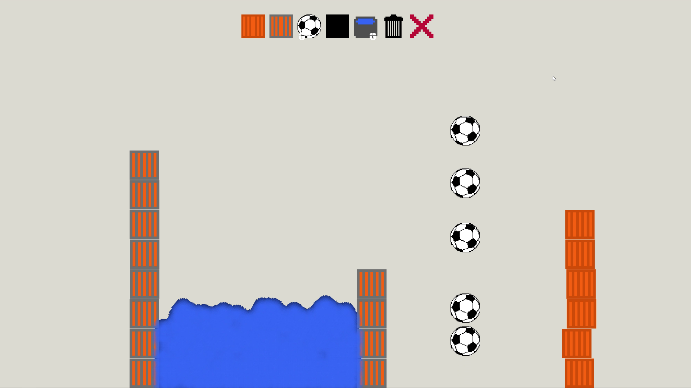

  

## Build

0- Install efc (electron for construct) `npm i @efc/cli`  
1- Export Construct project to html to `/efc/app` unziped  
2- Run `npm run new`  
3- Edit `/efc/config.js`  
4- Run `npm run build`  
5- Build is in /efc/dist  

## config.js example

```javascript
module.exports = config => ({
  electron: '6.0.1',
  errorLogging: true,
  singleInstance: false,
  window: {
    width: 640,
    height: 360,
    fullscreen: false,
    frame: true,
    transparent: false,
    toolbar: true,
    alwaysOnTop: false,
    resizable: false,
  },
  build: {
    asar: true,
    dir: 'app',
    out: 'dist',
    overwrite: true,
    icon: '../animations/icon/icon.png',
    platform: 'win32',
    arch: 'ia32',
    prune: true,
  },
  debug: {
    showConfig: false,
  },
  developer: {
    showConstructDevTools: false,
    autoClose: false,
    autoReload: false,
    showChromeDevTools: false,
    overlay: null,
  },
  project: {
    name: 'PhysicsSandbox',
    description: 'Just a physics playground for you to mess with.',
    author: 'AdnanMula',
    version: '0.1.0',
  },
  switches: [],
});
```

 
 
 
 
 
 
