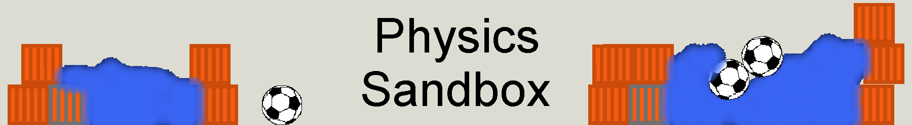
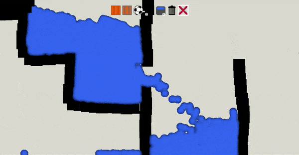

  

   
   
   
   
   

## Build for desktop with electron

0- Install dependencies `npm i`  
1- Export Construct project to html to `/efc/app` unziped  
2- Run `npm run new`  
3- Edit `/efc/config.js` (config.js.dist is an example)  
4- Run `npm run build`  
5- Build is in /efc/dist  
